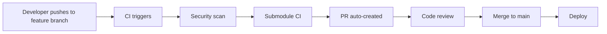

# Pull Request Automation

## 🤖 Automated PR Creation

The monorepo uses **system-level PR automation** to streamline the development workflow and ensure consistency across all feature branches.

## How It Works

### 1. **Automatic Trigger**

Pull requests are automatically created when:

- ✅ Code is pushed to any feature branch (not `main`)
- ✅ Security scans pass
- ✅ Submodule CI workflows complete successfully
- ✅ Commit message doesn't contain `[skip-pr]`

### 2. **PR Content Generation**

The system automatically generates:

- **Title**: From commit message (following conventional commit format)
- **Description**: Enhanced with CI status, validation results, and metadata
- **Labels**: Based on branch name and commit type
- **Base Branch**: Always targets `main`

### 3. **Required Permissions**

The automation requires:

- `GH_PAT` secret with repository permissions
- Write access to create PRs
- Read access to submodule repositories

## Configuration

### Environment Variables

```yaml
secrets:
  GH_PAT: # GitHub Personal Access Token with repo scope
```

### Skip PR Creation

To skip automatic PR creation, include `[skip-pr]` in your commit message:

```bash
git commit -m "feat: update docs [skip-pr]"
```

## Branch Protection

PRs created by automation respect branch protection rules:

- ✅ Required status checks
- ✅ Required reviews
- ✅ Dismiss stale reviews
- ✅ Require branches to be up to date

## Workflow Integration

### Submodule Coordination

1. **Parent Repo**: Detects changes, triggers submodule CI
2. **Submodule**: Runs tests, builds, reports back
3. **Parent Repo**: Waits for completion, creates PR
4. **Merge**: Manual review + approval required

### Status Checks

All PRs include automated validation:

- 🔒 Security scan (gitleaks)
- 🛡️ Dependency audit (pnpm audit)
- 🧪 Submodule test results
- 📝 Code quality checks

## Troubleshooting

### Common Issues

**PR not created automatically:**

```bash
# Check if branch follows naming convention
git branch --show-current  # Should be: feature/*, fix/*, etc.

# Verify no [skip-pr] in commit message
git log -1 --pretty=format:"%s"

# Check CI status
gh run list --branch $(git branch --show-current)
```

**Submodule CI not triggered:**

```bash
# Verify submodule repository exists and is accessible
gh api repos/$OWNER/$SUBMODULE_NAME

# Check GH_PAT permissions
gh auth status
```

**PR creation fails:**

```bash
# Check token permissions
gh api user  # Should return user info

# Verify repository access
gh api repos/$OWNER/$REPO
```

## Manual Override

If automatic creation fails, create PR manually:

```bash
# Ensure you're on feature branch
git checkout feature/your-feature

# Create PR with proper template
gh pr create \
  --title "$(git log -1 --pretty=format:'%s')" \
  --body "Auto-generated PR failed. Manual creation." \
  --base main
```

## Best Practices

### 1. **Conventional Commits**

Use semantic commit messages for better PR titles:

```bash
git commit -m "feat: add user authentication"
git commit -m "fix: resolve login validation bug"
git commit -m "docs: update API documentation"
```

### 2. **Branch Naming**

Follow established patterns:

```bash
feature/user-authentication
fix/login-validation
docs/api-update
refactor/auth-service
```

### 3. **Small, Focused Changes**

- Keep PRs small and focused
- One feature/fix per PR
- Clear, descriptive titles

### 4. **Testing Before Push**

Always run local validation before pushing:

```bash
pnpm ci:local  # Runs format, lint, submodule checks
pnpm test     # Run tests
```

## Security Considerations

- 🔒 **Token Security**: `GH_PAT` is stored as encrypted secret
- 🛡️ **Permission Scope**: Minimal required permissions (repo access only)
- 🔍 **Audit Trail**: All PR creation events are logged
- 🚫 **Branch Protection**: Direct pushes to `main` are blocked

## Integration with Development Workflow



This automation ensures:

- ✅ **Consistency**: All PRs follow the same format
- ✅ **Security**: Automated security validation
- ✅ **Efficiency**: Reduced manual overhead
- ✅ **Quality**: Integrated testing pipeline
- ✅ **Traceability**: Clear audit trail

---

_For issues or improvements, update this documentation and the CI workflows in `.github/workflows/monorepo-ci.yml`._
